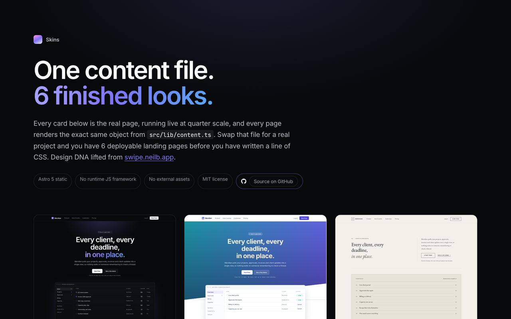
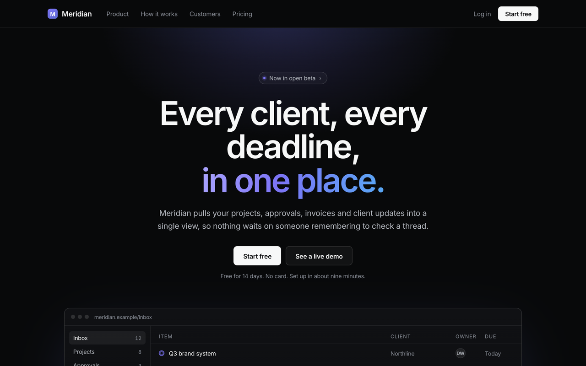
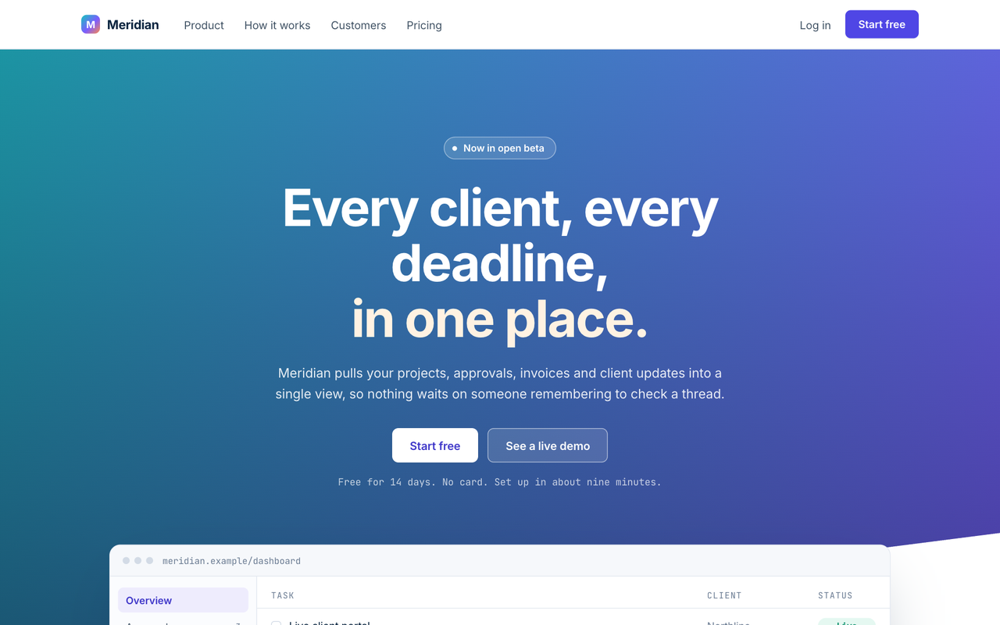
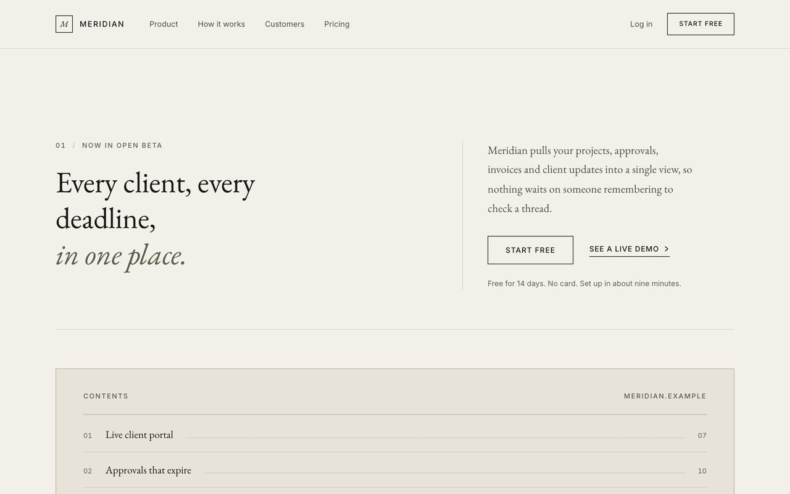
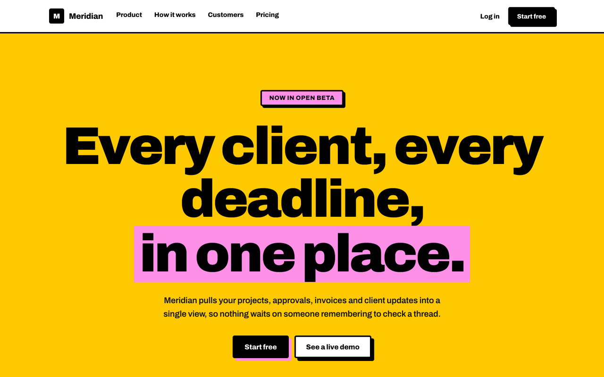
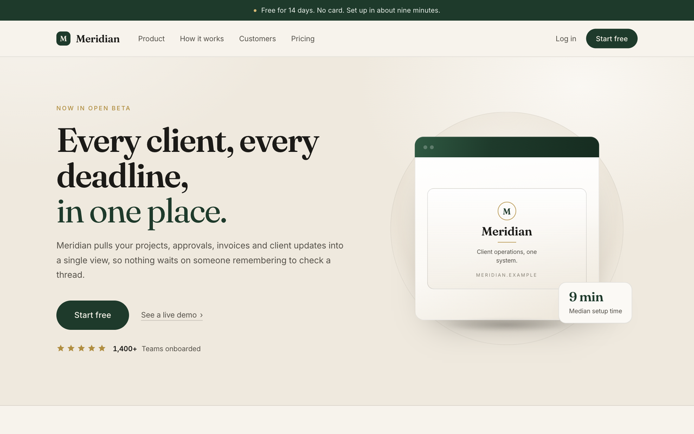
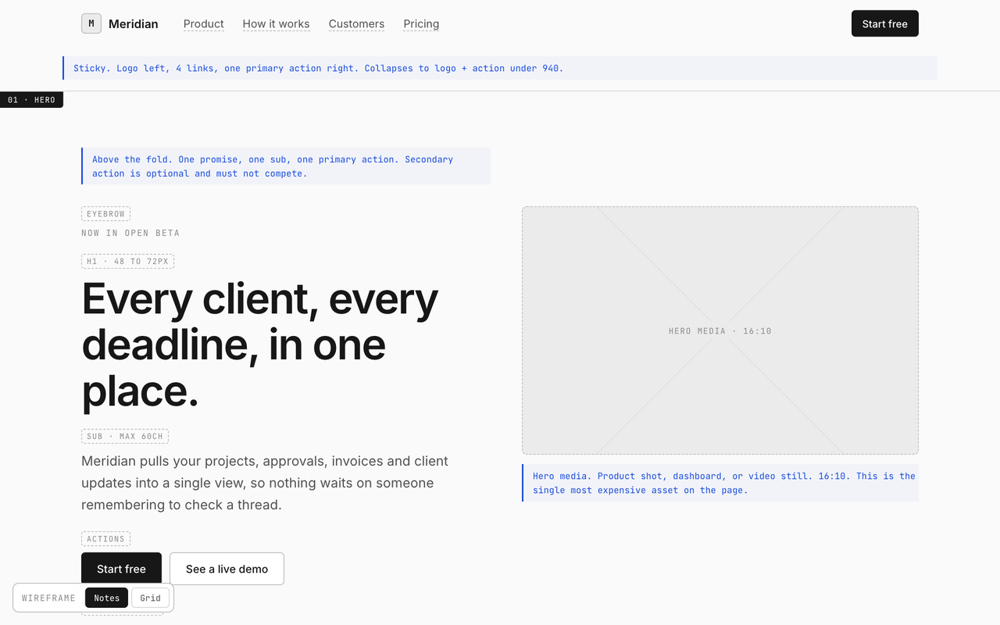

# Skins

Six reusable landing page skins. One content file, six finished looks.

Live: **https://skins.neilb.app** · MIT licensed

[](https://skins.neilb.app)

Every card in the gallery is the real page, running live at quarter scale. Design DNA lifted from
the [swipe](https://swipe.neilb.app) reference library. Astro 5, static output, no UI framework,
no external assets, Google Fonts only.

---

## The idea

`src/lib/content.ts` exports one typed object. Every skin renders that object and nothing else.
Replace the object with a real project's copy and you have six deployable landing pages before you
have written any CSS.

```
src/lib/content.ts        the contract. all copy lives here.
src/lib/skins.ts          the registry. gallery cards read from it.
src/layouts/Skin.astro    head, fonts, reveal observer, skin switcher bar.
src/skins/<id>/Page.astro one self-contained skin. all markup, all css.
src/pages/s/<id>.astro    3-line route that wires the layout to the skin.
```

## The six

Same words, six arguments. Every screenshot below is the identical `content.ts` object.

| | |
|---|---|
| [](https://skins.neilb.app/s/linear/) **Linear Dark** · app and product launches | [](https://skins.neilb.app/s/stripe/) **Stripe Corporate** · B2B, client sites, trust |
| [](https://skins.neilb.app/s/aesop/) **Aesop Editorial** · personal brand, high ticket | [](https://skins.neilb.app/s/gumroad/) **Gumroad Bold** · offers that should shout |
| [](https://skins.neilb.app/s/longform/) **AG1 Longform** · long-form sales, VSL, sticky CTA | [](https://skins.neilb.app/s/wire/) **Wireframe** · structure only, annotated |

| Skin | Route | swipe ref | Reach for it when |
|---|---|---|---|
| **Wireframe** | `/s/wire/` | none | You have copy and need to test the structure before anyone argues about colour |
| **Linear Dark** | `/s/linear/` | `linear-dark` | App or product launch. Anything with a UI |
| **Stripe Corporate** | `/s/stripe/` | `stripe-corporate` | B2B services, client sites, anything that has to look trustworthy |
| **Aesop Editorial** | `/s/aesop/` | `aesop-editorial` | Personal brand, high ticket, luxury. Calm and expensive |
| **Gumroad Bold** | `/s/gumroad/` | `gumroad-bold-type` | Offers, productized services, anything that should shout |
| **AG1 Longform** | `/s/longform/` | `ag1-longform` | Long-form sales and VSL. Quiz entry, proof stack, guarantee, sticky CTA |

On any skin page, press `[` and `]` to cycle through the others.

## Using one on a real project

1. **Wireframe first.** Put the real copy in `src/lib/content.ts` and open `/s/wire/`. It is
   greyscale and annotated, with two toggles in the top right: **Notes** (the annotation layer) and
   **Grid** (a 12 column overlay). Fix the structure and the words there.
2. **Pick the skin by job, not by taste.** The table above is the routing rule.
3. **Copy two files out.** `src/skins/<id>/Page.astro` and `src/lib/content.ts` are the whole skin.
   Every selector is prefixed (`.lin-`, `.str-`, `.aes-`, `.gum-`, `.lf-`, `.wf-`) and every visual
   is CSS or inline SVG, so it drops into any Astro project without collisions. Recolour the custom
   properties at the top of the style block and you are done.

## Adding a skin

Contributions follow the same contract the six ship with:

- Read from `content`. Never hard-code marketing copy in a skin.
- Unique class prefix. Every selector in the file starts with it.
- No external images or CDN assets. Build visuals from CSS and inline SVG.
- Use `data-reveal` for scroll reveals. The layout owns the IntersectionObserver.
- Carry the anchor ids `features`, `showcase`, `proof`, `pricing`, `cta`.
- Respect `html.embed` (set by `?embed=1`): the gallery embeds every skin as a live preview, so
  entry modals and page furniture must stay quiet in that mode.
- No em dashes in any authored text.
- Add an entry to `src/lib/skins.ts` and a route in `src/pages/s/`.
- Never use `<template set:text={longString}>`. It hangs the Astro compiler with no error.
- Run the QA suite. It has to pass on every route before a PR.

## Commands

```bash
nvm use 22
npm install
npm run dev            # localhost:4321
npm run build          # -> dist/

# QA. Headless Chrome cannot reach a server started in a separate sandboxed
# command, so serve and drive in ONE invocation:
npm run build && (python3 -m http.server 4411 --directory dist &) && sleep 1 && \
  QA_BASE=http://127.0.0.1:4411 npm run qa

# Regenerate the OG image and the README screenshots:
QA_BASE=http://127.0.0.1:4411 npm run shots
```

QA asserts, for all seven routes at 1440px and 375px: HTTP 200, no console errors, no failed
requests, exactly one `h1`, no horizontal overflow, all section anchors, all scroll reveals fired,
no em dashes, six live previews on the gallery, and that embed mode hides the switcher bar and
suppresses the longform entry modal. Screenshots land in `qa-shots/`.

## License

[MIT](LICENSE). The demo copy (the fictional "Meridian" product, its testimonials and stats) is
placeholder content and ships under the same license.
